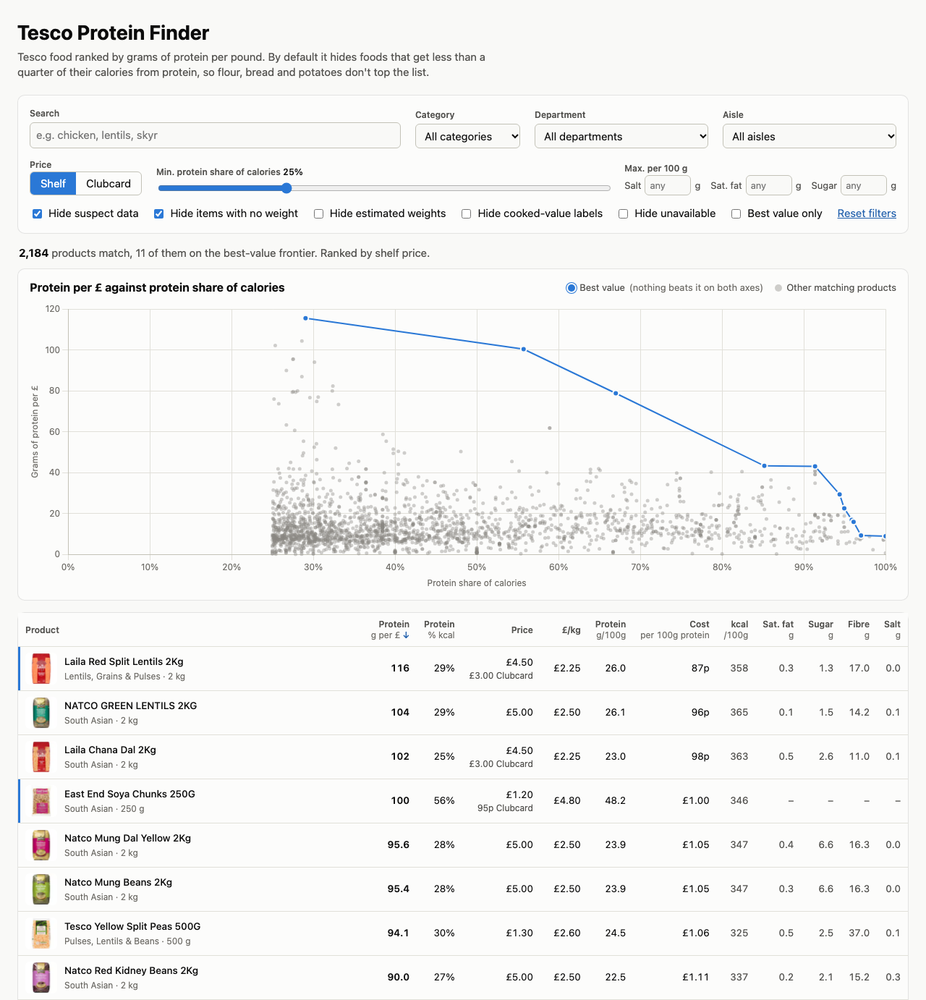

# Tesco Protein Finder

Which Tesco foods give the most protein per £, without counting "cheap protein" like flour or potatoes?

**[Open the site →](https://p4gan.github.io/TescoScraperNutrition/)**

<a href="https://p4gan.github.io/TescoScraperNutrition/">
  <picture>
    <source media="(prefers-color-scheme: dark)" srcset="docs/screenshot-dark.png">
    
  </picture>
</a>

## What it does

The site ranks about 12,900 foods from Tesco's Fresh Food, Bakery, Frozen Food, Food Cupboard and Treats & Snacks categories by grams of protein per £.

- **Shelf or Clubcard price.** Multibuys ("Any 3 for £10") count at the per-item price, or can be left out.
- **Protein share of calories filter.** Flour and potatoes give a lot of protein per £, but you would have to eat mostly flour to hit a protein target. By default the site hides anything that gets less than 25% of its calories from protein. You can raise it: lentils are about 29%, eggs 38%, chicken breast about 80%.
- **Limits** on salt, saturated fat and sugar per 100 g, plus category, aisle and text search.
- **Best-value chart:** products that nothing beats on both protein per £ and protein share.
- Filters, sort and price mode are kept in the URL, so you can share a view.

## How the numbers are cleaned

Tesco's nutrition labels are messy, so `scraper/build.py` does more than read a column:

- It picks the per 100 g column from headers like `(microwaved) Per 100g`, `100g of Sausage, as sold, contains` or a second, empty `Per 100g` column, and skips %RI columns.
- It converts cooked values back to as-sold weight when the label states a yield ("400g typically weighs 354g"). Labels that give only cooked values get a *cooked values* badge.
- It estimates the weight of items sold "each" from the label's serving size, for example 12 × "One typical egg (61g)".
- It leaves bone and eggshell out of the weight, because labels describe the edible part. Without this, chicken wings looked nearly twice as good value as they are.
- It flags labels whose macros add up to more than 100 g or don't match the calories, and prices per kg that disagree with Tesco's own unit price. These are hidden by default.

## Running it yourself

You need Python 3.10+ and the public API key the tesco.com web app uses (see `.env.example`).

```sh
pip install -r requirements.txt
cp .env.example .env              # then add the API key
python scraper/fetch.py           # fetch all five categories into data/raw/ (~2.5 h at 2 requests/s; re-run to resume)
python scraper/build.py           # parse data/raw/ into docs/data.json (a few seconds, no API calls)
python -m http.server -d docs     # preview the site at http://localhost:8000
```

`fetch.py` options: `--category "Fresh Food"` (repeatable), `--limit N` for a test run, `--skip-listing` to retry missing products, `--refresh` to re-fetch cached ones. `build.py --check TPNC` prints how one product was parsed.

The site is plain HTML and JavaScript in `docs/`, served by GitHub Pages from `main` / `/docs`. To refresh the data, re-run both scripts and commit `docs/data.json`. `notebooks/explore.ipynb` loads the same data into pandas.

## Limitations

- Only the label's macros are used. Micronutrients aren't, so pork liver ranks well even though a 100 g portion has about twice the daily upper limit for vitamin A.
- About 950 products only have values for the cooked food and no yield statement, so their protein per £ may be off.
- 269 items sold "each" have no weight to estimate (mostly fruit, veg and cakes) and aren't ranked.
- Bone and eggshell shares are typical values for each cut, not measured per product.
- Prices are a snapshot; the site shows the date. Check the product page before relying on a number.

Possible next steps: price history from dated snapshots, micronutrients from the UK CoFID database, and a "cheapest basket" optimiser for a protein and calorie target.

Not affiliated with Tesco.
